- 👋 Hi, I’m Jerry Chiu, Data Scientist.
- 👀 I’m interested in all sorts of projects from market basket analysis to time series forcasting to classifying heartbeats! 
- 🌱 Some of my favorite techniques to use are clustering, text mining, collaborative filtering, and ensemble models. 

Below are some of the projects I did:

# Instacart project with R

The instacart project is a project of association rule mining and a bit of network analysis. Technique used are: hierarchical clustering, text mining, parts-of-speech tagging, apriori association rules mining, and network graphs. 

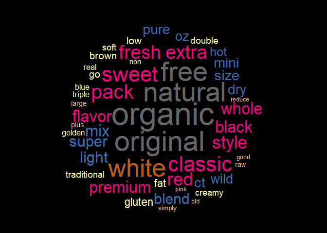
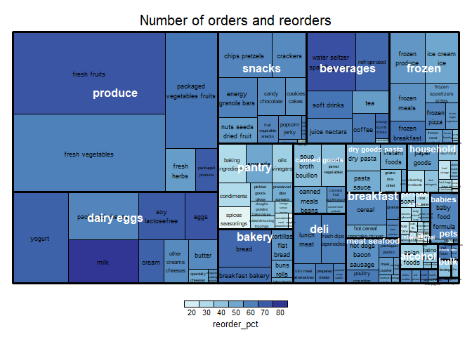
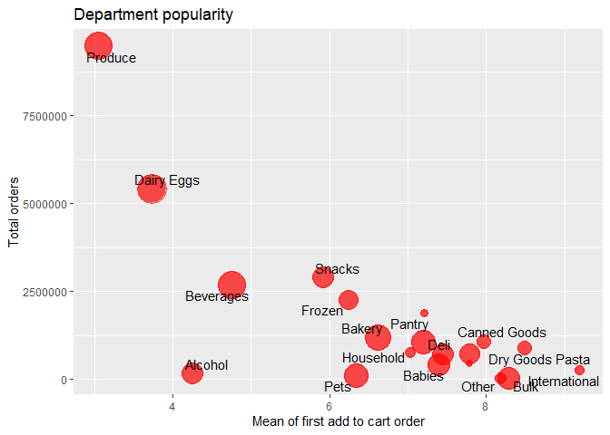
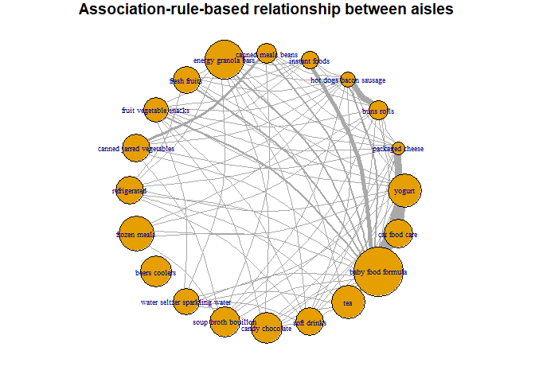

# Heartbeat prediction with Python (Keras)

I set out to predict 6 most frequent types of heartbeats given ECG graphs using neural network. The training data are annotated by cardiologists. The final accuracy of the deep learning model is around 96.8%. Data comes from the [MIT-BIH Arrhythmia Database](https://www.physionet.org/content/mitdb/1.0.0/). Special python package wfdb was used to read the ecg samples and annotations. 

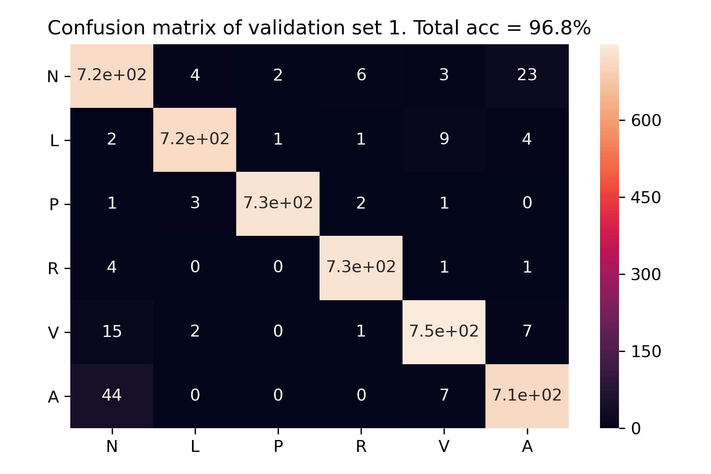
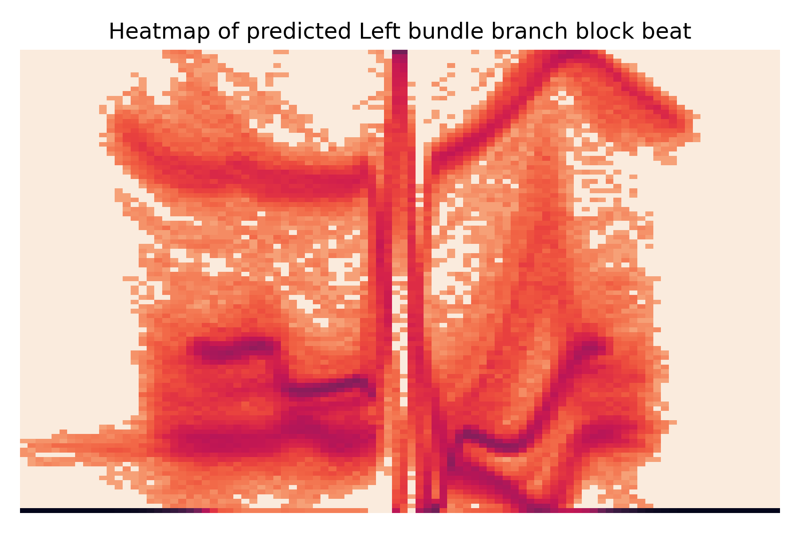
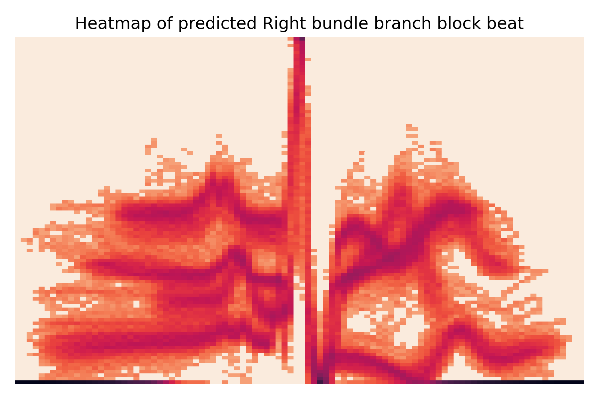
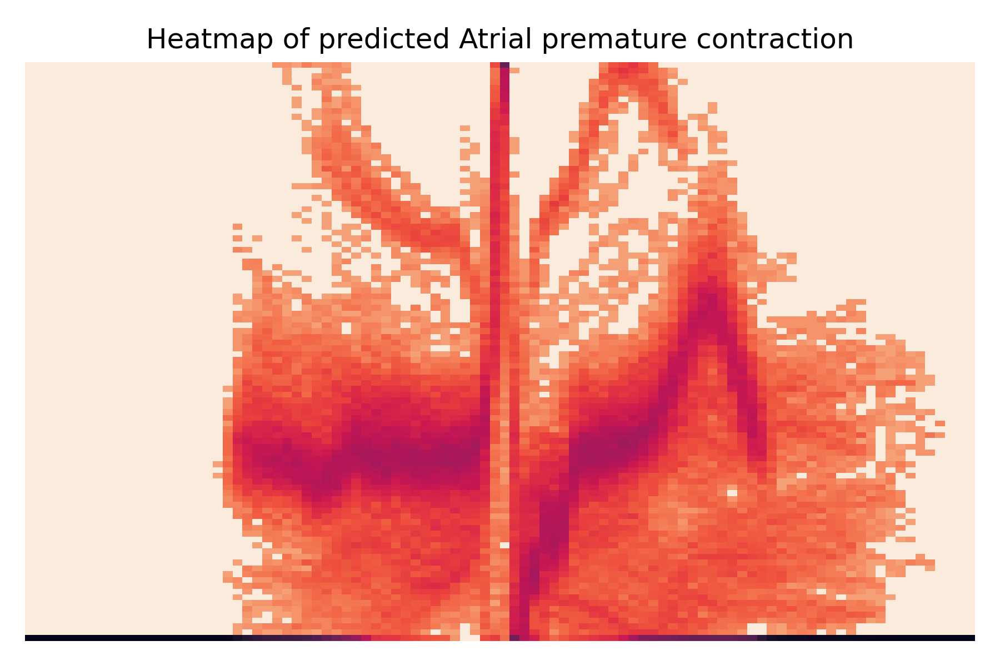

# Covid 19 forecasting with Python

Covid 19 forecasting for Ontario using three different methods: ARIMA, exponential smoothing, and dynamic time warping. Techniques used are: Fourier analysis, ARIMA, exponential smoothing, dynamic time warping, regression, and curve fitting.

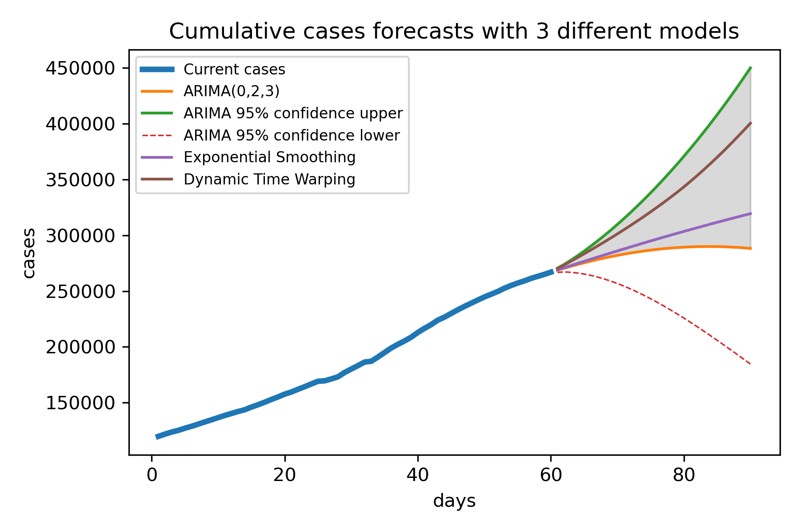
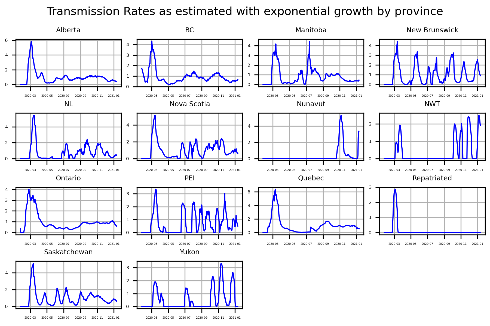
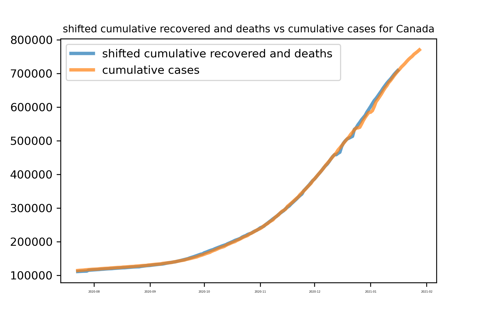
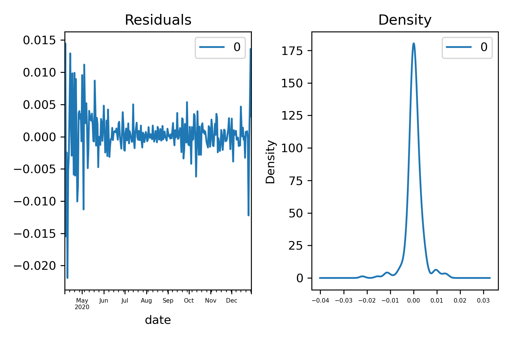